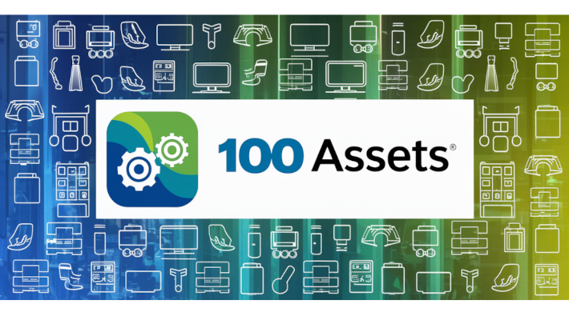

<p align="center">
  <a >
    
  </a>
</p>

# Project Introduction 
<a name="top"></a>


> [!CAUTION]
>
> Read this in other languages: [Polski](README.pl.md)

> [!TIP]
>
> <p align="justify">
>  This project aims to create a web application for managing hardware assets for companies, facilitating the assignment of equipment (e.g., laptops, printers) to employees and tracking its history. Key features include asset registration, management, and tracking of assignments and usage. The application will also provide a module with operating instructions and technical support, enhancing operational efficiency and support quality for users. </p>


> [!NOTE]
>
> This project is being developed thanks to the [100commitow.pl](https://100commitow.pl) competition. The challenge starts on March 1, 2024, and will last until June 9, 2024.
>
> My goal is not only to maintain regular work on the project but also to develop programming skills, learn new technologies, and refine existing code. I believe that consistency in daily coding will allow me to make significant progress in my project.


## Main Features at Launch:

1. **Registration and Management of Hardware Assets:**
- [ - ] Ability to add new assets to the system (e.g., laptops, printers, etc.), along with their detailed specifications such as brand, model, serial number, purchase date, warranty period.
- [ - ] Categorization of equipment for easier management and search.
- [ - ] Ability to update information about an asset, such as brand, model, serial number, purchase date, or warranty period, after its registration in the system.
- [ - ] Function allowing the removal of assets from the system, e.g., in case of sale, liquidation, or loss of equipment.
- [ - ] Search and filter options for assets based on various criteria, e.g., category, brand, availability.

2. **Assigning Equipment to Users:**
- [ - ] Function enabling the assignment of equipment to specific users within the organization, along with the assignment date.
- [ - ] Ability to quickly review who currently possesses a given piece of equipment.
- [ - ] Ability to change the user to whom the equipment is assigned, e.g., in case of a job position change or employee departure.
- [ - ] Procedure for returning equipment to the pool of available assets, along with the ability to record the date and conditions of the return.
- [ - ] Extension of assignment history with detailed information, such as reasons for assignment changes, responsible persons.

3. **Equipment History:**
- [ - ] Automatic recording of the history of each piece of equipment, including dates of assignment to users, any repairs, servicing, or exchanges.
- [ - ] Transparent tracking of each asset's lifecycle.
- [ - ] Ability to correct entries in the equipment history, e.g., in case of incorrect data concerning repairs or servicing.
- [ - ] Function allowing the addition of notes or attachments to the equipment history, e.g., service documentation, repair invoices.

4. **Assignment History for Users:**
- [ - ] Enabling users to review the history of equipment that has been assigned to them, along with the periods of possession.
- [ - ] Quick access to information about all assets that a user has utilized.
- [ - ] Ability to export the assignment history of equipment for individual users, e.g., to PDF or Excel files, for audit or management purposes.

<br> 

## Additional Features Planned for Later:
1. **Module for Adding Operating Instructions:**
- [ - ] Ability for the administrator to add operating instructions, troubleshooting guides, and other support documents for specific equipment categories.
- [ - ] Facilitating access to operating instructions and support in resolving technical issues for users.
- [ - ] Ability for the administrator to edit and delete existing operating instructions, guides, and support documents.
- [ - ] Tagging and advanced search: Implementation of a tagging system for documents, enabling easy categorization and search of operating instructions based on specific problems or equipment models.
- [ - ] Integration of an automated response system for frequently asked questions and building a knowledge base that enables users to solve some problems independently.

<br>

## Future Extensions:
1. **Dashboard and Reports**
- [ - ] General overview of asset status: Creation of a central dashboard providing a quick insight into the general status of the company's hardware assets, including information about the total number of assets, the number of assets in use, and available assets.
- [ - ] Detailed asset reports: Ability to generate detailed reports for specific equipment categories, containing data such as brand, model, serial number, status (e.g., in use, under service), purchase date, and warranty period.
- [ - ] Equipment usage analysis: Visualization of data concerning equipment usage, enabling identification of trends and optimization of resource management.
- [ - ] Technical issue reporting: Integration with the technical support system, enabling tracking and reporting of reported technical issues, their statuses, and resolution time.
- [ - ] Asset history and lifecycle: Providing reports showing the history of each asset, from purchase through assignments, repairs, to eventual disposal.
- [ - ] Asset availability reports: Creating reports showing the current availability of assets, including unassigned equipment ready for issue, which facilitates planning and resource allocation.
- [ - ] Cost analysis: Generating reports on costs associated with hardware assets, including purchasing new equipment, repair and maintenance costs, which aids in IT budget management.
- [ - ] Asset statistics and forecasts: Using historical data to create forecasts concerning future needs for hardware assets, helping in strategic planning of purchases.
- [ - ] Software license management: Integrating information about licenses and software installed on individual assets, including expiration dates of licenses, which helps in avoiding legal and operational risks.
- [ - ] Data visualizations: Using graphs, charts, and heatmaps to present data visually, which facilitates the understanding of complex information and quick decision-making.

2. **Issue Management and Technical Support:**
- [ - ] Integration of a system for reporting and tracking technical issues related to equipment, enabling users to quickly report failures or problems.
- [ - ] A tool for the administrator to manage reports, coordinate repairs, and communicate with users.

<br>
<br>

## Technology Stack:

### Frontend
| Icon                                                  | Name                              |
| ------------------------------------------------------- | ---------------------------------------- |
|                            | React   |
|                            | TypeScript   |
|                        | NodeJS?  |
|                         | Tailwind   |

<br>

### Backend
| Icon                                                    | Name                              |
| ------------------------------------------------------- | ---------------------------------------- |
|                          | Python   |
|                          | Flask   |
|                            | JSON Web Token   |

<br>

### Others
| Icon                                                    | Name                              |
| ------------------------------------------------------- | ---------------------------------------- |
|                          | Docker   |


## Application Overview:

```bash
TODO
```
<br>

> [!IMPORTANT]
>
>  HOW TO RUN THE APPLICATION:
> ```bash
> TODO
> ```

> [!WARNING]
>
> The documentation (README file) is under construction. As the project evolves, the documentation will be progressively updated and expanded.

[Back to Top](#top) ⬆️

// need more coffee 14
